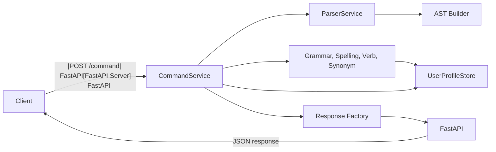

# Smart Grammar Checker

A **Python FastAPI** server that interprets a custom **Domain‑Specific Language (DSL)** for grammar checking, spelling suggestions, verb look‑ups, synonym look‑ups, and personalized revision planning. The server parses user commands, runs rule‑based linguistic analyses, maintains per‑user revision history, and returns structured JSON responses ready for any client (React, React‑Native, mobile, etc.).

---

## Problem Statement

Traditional spell‑checkers give only generic feedback. Learners need a **command‑driven** interface that can:

- Detect and correct spelling mistakes with context‑aware suggestions.
- Highlight grammatical issues (agreement, tense, verb forms, etc.).
- Remember recurring mistakes across sessions to suggest a personalized revision plan.
- Provide quick look‑ups for verb conjugations and synonyms.

Our DSL‑based backend provides an interactive, transparent solution that bridges raw text input and detailed linguistic feedback.

---

## Technology Stack

| Layer            | Tech / Library                                   |
|------------------|--------------------------------------------------|
| **Server**       | FastAPI, Uvicorn (ASGI)                         |
| **Parsing**      | ANTLR 4 (GrammarDSL.g4 → lexer + parser)        |
| **Validation**   | Pydantic (request/response models)               |
| **Storage**      | SQLite via `UserProfileStore` (editable)         |
| **Python**       | 3.8+ (type‑annotated, async‑ready)               |

---

## Architecture



**Key ideas**

- **Session‑based**: each `sessionId` gets its own history & revision profile.
- **DSL‑driven**: commands are parsed with ANTLR, turned into command objects, then dispatched.
- **Rule‑based engines**: grammar, spelling, verb, synonym are pure functions operating on a compiled knowledge base.

---

## Key Components

| Component | Responsibility |
|-----------|-----------------|
| `CommandService` | Entry point; parses DSL, routes to appropriate engine, logs history, builds JSON payloads |
| `ParserService` | ANTLR lexer + parser; produces a concrete syntax tree |
| `ASTBuilder` | Converts parse tree into high‑level command objects (`CheckGrammarCommand`, `ShowTokensCommand`, …) |
| `GrammarChecker` | Rule‑based analysis of sentence structure, agreement, tense, etc. |
| `SpellingChecker` | Levenshtein‑based candidate generation, context‑aware ranking (verb preference) |
| `VerbEngine` / `SynonymEngine` | Look‑ups in compiled lexical resources |
| `UserProfileStore` | SQLite store for command history, issue statistics, revision plans |
| `RevisionPlanner` | Generates a personalized checklist from recurring mistakes |
| `ResponseFactory` | Uniform JSON response creator (success / error, with `type`, `message`, `data`, `suggestions`) |

---

## Supported DSL Commands

| Command | Description | Example |
|:---|:---|:---|
| `help` | Show all supported DSL commands and pipeline stats | `help` |
| `show tokens <command>` | Inspect lexer output for a DSL snippet and verify it parses | `show tokens check grammar I go to school yesterday.` |
| `check grammar <text>` | Run full grammar, spelling, and semantic heuristics; returns corrected text and issues | `check grammar I go to chracter yesterday.` |
| `history` | Retrieve recent commands for the current user | `history` |
| `revision plan` | Build a personalized revision checklist from past mistakes | `revision plan` |
| `reset history` | Clear the current user's stored command history and revision profile | `reset history` |
| `spell <word>` | Verify a word against the dictionary and get suggestions | `spell generte` |
| `verb <word>` | Look up V1/V2/V3 forms for a verb | `verb know` |
| `synonym <word>` | Retrieve synonyms for a word | `synonym smart` |

---

## Request / Response Format

### Request (POST `/command`)
```json
{
  "sessionId": "string",   
  "command": "string"     
}
```

### Common Responses

#### Help / Menu
```json
{
  "status": "success",
  "type": "help",
  "message": "Supported commands: help, show tokens, check grammar, history, revision plan, reset history, spell, verb, synonym",
  "data": {}
}
```

#### Grammar Check
```json
{
  "status": "success",
  "type": "check grammar",
  "message": "Analyzed 1 sentence(s) and found 2 issue(s).",
  "data": {
    "original_text": "I go to chracter yesterday.",
    "corrected_text": "I went to the character yesterday.",
    "sentence_count": 1,
    "spelling_issues": [{
      "token": "chracter",
      "suggestion": "character",
      "alternatives": ["character", "cheater", "charger"]
    }],
    "grammar_issues": []
  }
}
```

#### Error
```json
{
  "status": "error",
  "message": "Unknown command or invalid syntax. Type 'help' to see available commands."
}
```

---

## Running the Project

### Prerequisites
- **Backend**: Python 3.8+ (3.11 recommended)
- **Frontend**: Node.js 18+ and npm
- **Parsing**: Java 8+ (only required if you need to regenerate the ANTLR parser)

### Step 1: Start the Backend
From the project root:
```bash
# Optional: create virtual environment
python -m venv .venv
source .venv/bin/activate  # On Windows: .venv\Scripts\activate

# Install dependencies
pip install -e backend
pip install -r backend/requirements.txt

# Run the server
python backend/run.py serve --host 127.0.0.1 --port 8000
```
The server will be available at `http://127.0.0.1:8000`.

### Step 2: Start the Frontend
Open a new terminal and run:
```bash
# Install dependencies
npm install

# Start development server
npm run dev
```
The workspace will be available at `http://localhost:5173/grammar`.

### Step 3: Verify Everything Works
1. Open `http://localhost:5173/grammar` in your browser.
2. Log in with a demo account (e.g., `alice / alice123`).
3. Type `help` in the command box and press Enter.

---


## Client Integration (brief)

Any client that can POST JSON can talk to the API. Example in JavaScript:
```js
async function sendCommand(sessionId, cmd) {
  const res = await fetch('http://localhost:8000/command', {
    method: 'POST',
    headers: { 'Content-Type': 'application/json' },
    body: JSON.stringify({ sessionId, command: cmd })
  });
  return res.json();
}
```
Render UI based on `response.type` (`help`, `check grammar`, `spell`, `verb`, …) and display `response.data` accordingly.

---

## Example Sessions

### Grammar Check with Spelling Suggestion
```bash
curl -X POST http://127.0.0.1:8000/command \
  -H 'Content-Type: application/json' \
  -d '{"sessionId":"alice","command":"check grammar I lke her."}'
```
*Response* → corrected text `I like her.` and a spelling‑issue object.

### Verb Look‑up
```bash
curl -X POST http://127.0.0.1:8000/command \
  -H 'Content-Type: application/json' \
  -d '{"sessionId":"bob","command":"verb go"}'
```
*Response* → `go – went – gone`.

### View History
```bash
curl -X POST http://127.0.0.1:8000/command \
  -H 'Content-Type: application/json' \
  -d '{"sessionId":"alice","command":"history"}'
```
Shows recent commands with their status and messages.

---

## Extending the Server

1. **Add a new linguistic rule** – extend `grammar_checker.py` with a new check function and register it.
2. **New DSL command** – add a token/rule in `GrammarDSL.g4`, regenerate the parser, and implement a handler in `command_service.py`.
3. **Persist sessions** – replace the SQLite store with a remote DB (PostgreSQL, Redis) without altering the API.

---

## Troubleshooting

| Symptom | Likely Cause | Fix |
|---------|--------------|-----|
| `Connection refused` on `localhost:8000` | Server not running or wrong port | Run the server start command above and verify the health‑check endpoint |
| `DSLParseError` – “unknown token” | Miss‑typed command or missing brackets | Follow the exact DSL syntax; arrays must be surrounded by `[` `]` and comma‑separated |
| History not appearing | Different `sessionId` used across calls | Keep the same `sessionId` for a user; it keys the `UserProfileStore` |
| Missing suggestions | `dictionary_words` not loaded | Ensure the preprocessing step (`backend/run.py compile`) has been executed |

---

##  License

Distributed under the **MIT License**. See the `LICENSE` file for details.

---


