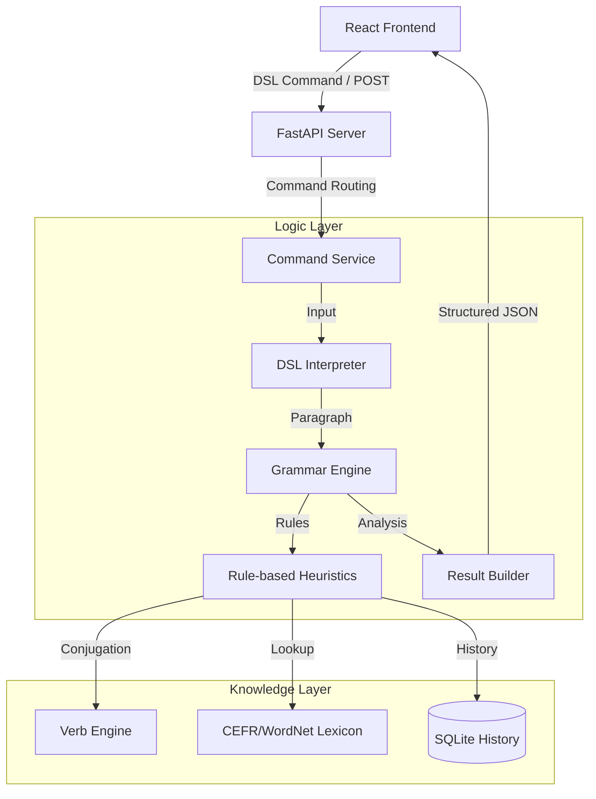

# Smart Grammar Checker
### A Domain-Specific Language (DSL) powered engine for rule-based English grammar analysis and correction.

Smart Grammar Checker is a modern linguistic analysis system that combines a custom Domain-Specific Language (DSL) with rule-based heuristics to provide precise, transparent, and personalized English grammar validation.

## Problem Statement
Learning and writing English can be challenging due to complex grammatical rules, particularly **Tense Consistency** across multiple clauses and **Subject-Verb Agreement**. Traditional grammar checkers often lack transparency regarding *why* a specific error was flagged.

This system addresses these challenges by:
- **DSL Interaction**: Enabling users to interact with the engine using natural commands like `check grammar`, `explain`, and `history`.
- **Transparent Heuristics**: Every detected error includes a specific Rule ID and detailed linguistic explanation.
- **Contextual Tense Propagation**: Automatically identifies the "timeline" of a paragraph to suggest consistent tense corrections across all related clauses.
- **Interactive Correction**: Provides an intuitive review interface that shows the exact origin of every suggestion.

## 🛠 Technology Stack
- **Backend**: Python 3.11+, FastAPI (REST API), SQLite (User Profiles & History)
- **Frontend**: React 18, Vite, Tailwind CSS, Vanilla CSS (Premium UI Aesthetics)
- **Parsing**: Custom Regex-based Lexer & Parser for DSL interpretation
- **Data Engine**: Heuristic-based Grammar Engine with specialized Verb & Synonym modules

## Architecture
The system follows a session-based, stateful architecture, routing data from DSL commands to deep linguistic analysis engines:



## DSL Syntax & Commands
The system supports a rich DSL command set for interacting with the grammar engine:

| Command | Description | Example |
| :--- | :--- | :--- |
| `check grammar <text>` | Analyzes grammar, spelling, and collocations. | `check grammar i goes to school.` |
| `explain grammar <text>` | Deep dive into tense structure and paragraph timeline. | `explain grammar she is working.` |
| `history` | View the history of executed DSL commands. | `history` |
| `revision plan` | Generates a personalized study plan based on frequent errors. | `revision plan` |
| `verb <word>` | Look up complete verb conjugation tables. | `verb study` |
| `synonym <word>` | Find academic and contextual synonyms. | `synonym happy` |

## Data Model (API)
### Request Format
```json
{
  "command": "check grammar However, I goes to the library every day."
}
```

### Expected Response Snippet
```json
{
  "status": "success",
  "data": {
    "original_text": "However, I goes to the library every day.",
    "corrected_text": "However, I go to the library every day.",
    "grammar_issues": [
      {
        "category": "Agreement",
        "message": "The subject 'I' should use 'do' instead of third-person forms.",
        "evidence": "goes",
        "suggestion": "go",
        "rule_id": "RULE-SUBJECT-VERB"
      }
    ],
    "sentence_count": 1
  }
}
```

## Installation & Running

### Frontend (Project Root)
```bash
npm install
npm run dev
```
The User Interface will be available at: `http://localhost:5173/grammar`

### Backend (Backend Directory)
```bash
# Install dependencies
python -m pip install -e backend

# Start the server
python backend/run.py serve --host 127.0.0.1 --port 8000
```
The API server will be listening at: `http://127.0.0.1:8000`


