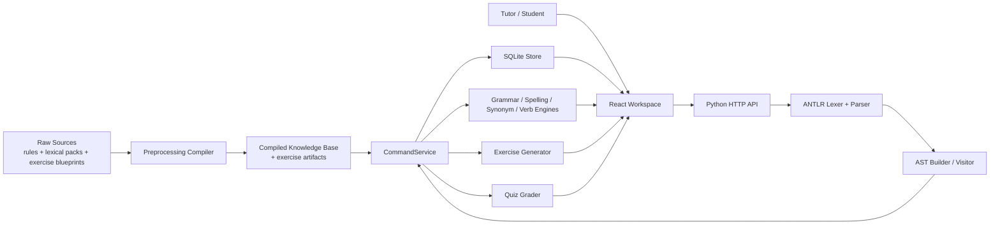

# Smart Grammar Checker using DSL and Rule-Based Parsing

GrammarDSL is a **DSL-driven grammar learning platform** built around:

- an ANTLR lexer/parser for command input
- a rule-based grammar checker
- a local exercise generator
- tutor/student classroom flows backed by SQLite

It supports grammar checking, token inspection, personalized revision history, exercise generation, quiz creation, quiz submission, and tutor scorebook queries.

## What the system does

- `check grammar <paragraph>` checks spelling, grammar, and semantic collocations, then returns a corrected rewrite.
- `show tokens <command>` exposes the ANTLR token stream for a DSL snippet.
- `generate ...` creates local practice exercises from feature expressions such as `present simple AND affirmative`.
- tutors can create classes and quizzes
- students can join classes and submit quiz answers
- tutors can query scorebook rows with DSL filters such as `show students with score > 8 AND submitted`

## Architecture



## Technology stack

| Layer | Tech |
|---|---|
| Frontend | React + Vite |
| Backend API | Python `BaseHTTPRequestHandler` / `ThreadingHTTPServer` |
| Parsing | ANTLR 4 |
| Persistence | SQLite |
| Grammar analysis | Rule-based heuristics + compiled knowledge packs |
| Exercise generation | Local template + lexical-pool + morphology pipeline |

## Supported DSL commands

### Common commands

- `help`
- `show tokens <command>`
- `check grammar <paragraph>`
- `generate exercise with <feature-expr>`
- `generate <N> exercises with <feature-expr>`
- `revision plan`
- `history`
- `reset history`
- `spell <word>`
- `verb <word>`
- `synonym <word>`

### Tutor-only commands

- `create quiz "Title" with <N> exercises with <feature-expr>`
- `show students with <filter-expr>`

### Student-only commands

- `submit answers for quiz <quiz-id> { 1 = "..." ; 2 = "..." }`

## Feature expressions

V1 exercise generation supports:

- `present simple`
- `past simple`
- `future simple`
- `present continuous`
- `subject-verb agreement`
- `object pronoun`
- `verb-preposition`
- `svo`
- `affirmative`
- `negative`
- `interrogative`

Boolean composition is supported with `AND`, `OR`, and parentheses.

Examples:

- `generate exercise with present simple`
- `generate 5 exercises with present simple AND negative`
- `generate 5 exercises with (present simple AND affirmative) OR (past simple AND interrogative)`

## Running the project

Run everything from the **project root**:

```powershell
cd C:\GITHUB\Smart-Grammar-Checker-using-DSL-and-Rule-Based-Parsing
```

### 1. Install backend and frontend dependencies

```powershell
python -m pip install -e backend
npm install
```

### 2. Generate ANTLR artifacts

Only needed when the grammar changes:

```powershell
python backend/run.py gen
```

### 3. Compile the knowledge base

```powershell
python backend/run.py compile
```

### 4. Start the backend

```powershell
python backend/run.py serve --host 127.0.0.1 --port 8000
```

### 5. Start the frontend

Open a second terminal:

```powershell
cd C:\GITHUB\Smart-Grammar-Checker-using-DSL-and-Rule-Based-Parsing
npm run dev
```

Then open:

- [http://localhost:5173/grammar](http://localhost:5173/grammar)

## Demo accounts

Tutor accounts:

- `brian / brian123`
- `emma / emma123`

Student accounts:

- `alice / alice123`
- `clara / clara123`
- `david / david123`

You can also create a new **demo student** from the register page.

## Suggested demo flow

1. `help`
2. `show tokens check grammar I dont love she.`
3. `generate exercise with present simple`
4. `check grammar I dont love she.`
5. tutor creates a class and runs `create quiz ...`
6. student joins the class and submits answers
7. tutor runs `show students with submitted`

## Useful backend commands

```powershell
python backend/run.py help
python backend/run.py gen
python backend/run.py compile
python backend/run.py test
python backend/run.py exec "help"
python backend/run.py exec "generate exercise with present simple"
python backend/run.py exec "check grammar I dont love she."
```

## Current scope notes

- The platform is intentionally **rule-based and local-first** for v1.
- No external LLM or API is required for exercise generation.
- Quiz grading is **answer-key first**; grammar checking is used as feedback support, not as the grading engine itself.
- Some older long-form tense regression tests in the repo still reflect pre-existing heuristic limitations in the grammar engine.
